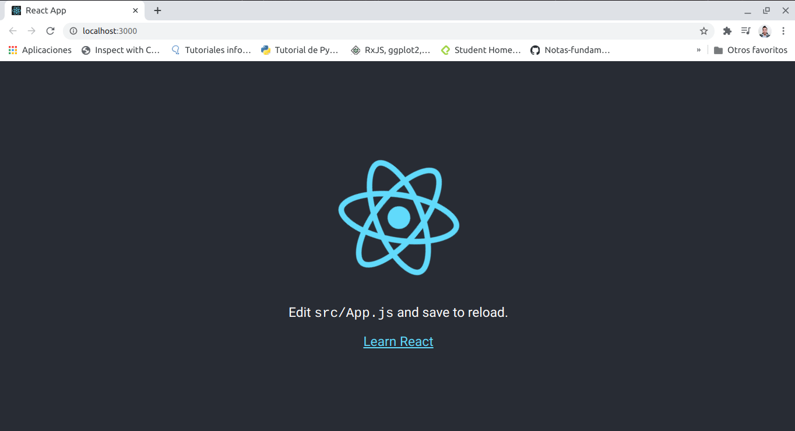
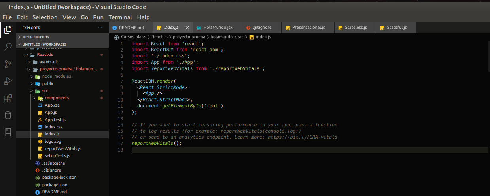
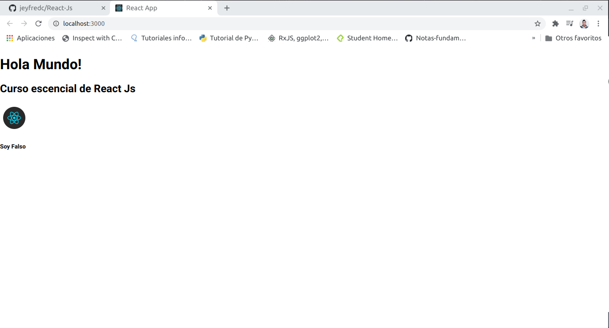
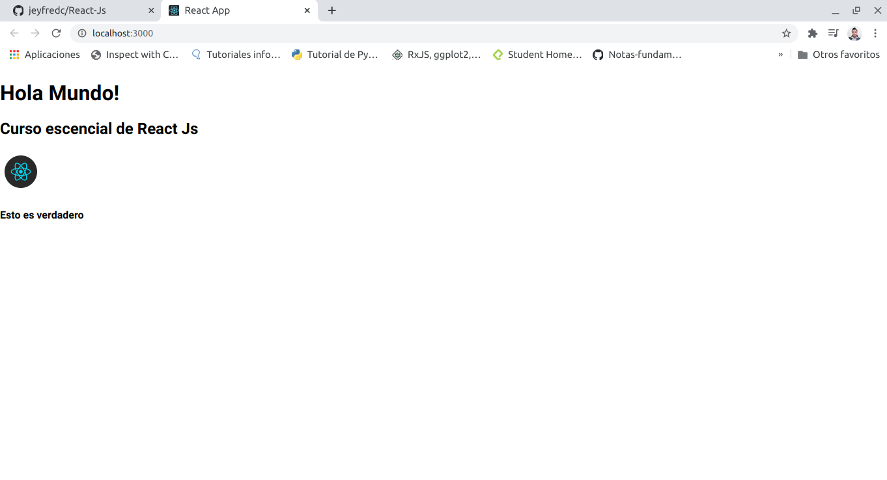

# React-Js

## Tabla de contenido 

[¿Qué es React JS?](#¿Qué-es-React-JS?)

[DOM, Virtual DOM y React DOM](#DOM-Virtual-DOM-y-React-DOM)

[Create React App y Tipos de Componentes](#Create-React-App-y-Tipos-de-Componentes)

[JSX: JavaScript + HTML](#JSX:-JavaScript-+-HTML)

[]()

[]()

[]()

[]()

[]()

[]()

[]()

[]()

[]()

[]()

[]()

[]()

[]()

[]()

[]()

[]()

<div align="right">
  <small><a href="#tabla-de-contenido">🡡 volver al inicio</a></small>
</div>

## ¿Qué es React JS?

**React** es una librería desarrollada por Facebook que nos ayuda a construir interfaces de usuario interactivas para todo tipo de aplicaciones: web, móviles o de escritorio.

Cada pequeña parte de nuestra página web la conoceremos como **“Componente”**. Cada componente se encargará de una función en específico. Además, podremos reutilizar nuestros componentes siempre que lo necesitemos.

Al unir todos nuestros componentes tendremos una página web que nos permite cambiar, actualizar o eliminar elementos de forma muy sencilla.

Esta basado en componentes por lo cual se deben separar cada uno de los elementos de la pagina web en pequeños pedazos.

React nace en el año 2013 dentro de Facebook donde se queria mejorar la parte principal que hoy en dia se utiliza en esta red social la cual es el **timeline**, ademas tambien esta integrada en instagram. Cuando los desarrolladores se dieron cuenta que esto era un buen producto lo liberaron a la comunidad.

Empresas como Airbnb, netflix, uber, whatsappweb, platzi hacen uso de estas librerias.

El proyecto de este curso se llamara **PlatziVideo**, el cual se viene desarrollando en la escuela de desarrollo web, ademas tendra login, sesiones, registro y un buscador de videos


<div align="right">
  <small><a href="#tabla-de-contenido">🡡 volver al inicio</a></small>
</div>


## DOM, Virtual DOM y React DOM

El **DOM** es el código HTML que se transforma en páginas web.

Cada vez que cambiamos alguna parte del DOM, también estamos actualizando el HTML con el que interactúan nuestros usuarios. El problema es que todas las operaciones, comparaciones y actualizaciones en el DOM son muy costosas.

El **Virtual DOM** es una herramienta que usan tecnologías como React y Vue para mejorar el rendimiento **(performance)** y velocidad de nuestras aplicaciones.

Es una copia exacta del DOM, pero mucho más ligera, ya que los cambios no actualizan el verdadero HTML de nuestras páginas web. Gracias al Virtual DOM podemos hacer operaciones y comparaciones de forma sumamente rápida.

Recuerda que los cambios en el Virtual DOM no afectan el HTML que ven los usuarios, así que debemos estar sincronizando constantemente las copias con el DOM. Pero no te preocupes, **React DOM**lo hace por nosotros.

El Virtual DOM ayuda a actualizar informacion que puede cambiar en la pagina sin la necesidad de tener que cargar cosa por cosa, por ejemplo el **feed** de un usuario en Facebook o twitter; Los datos de sesion de usuario, configuracion, etc. ya estan en el DOM y por ejemplo cuando una persona publica una foto o un estado es lo que se carga automaticamente, pero no afecta el resto de datos y permite que la informacion suba de una manera mas rapida y optima sin necesidad de volver a cargar todos los datos de usuario.

<div align="right">
  <small><a href="#tabla-de-contenido">🡡 volver al inicio</a></small>
</div>

## Create React App y Tipos de Componentes

### Inicialización de un proyecto en React

Creación de nuestro sitio web usando la plantilla por defecto de create-react-app:

Para empezar hay que hacer uso constante de la terminal y crear una carpeta donde se vaya a guardar el proyecto, el de este capitulo no es necesario guardarlo en un repositorio y sera el primer proyecto de prueba que se hara para empezar a conocer lo que es **React-Js**.

Para empezar en la ubicacion de la carpeta o proyecto ejecutar el siguiente comando en la terminal

```
npx create-react-app holamundo
```

a continuacion en el proyecto sera creada una carpeta **holamundo** la cual va a tener instalada todas las dependencias, carpetas , etc. que trae consigo React Js y a continuacion en la terminal moverse a la carpeta **holamundo**

Ahora se debe iniciar el servidor de desarrollo ejecutando el comando:

```
npm start
```

Al ejecutar este comando se obtendra un servidor en el puerto 3000, y se abrira automaticamente una pagina con el simbolo de react girando 



para finalizar el servidor en la terminal escribir `Ctrl + C`

y ahora abrir el proyecto en Visual studio code escribiendo en la terminal `code` o `code .`

El proyecto que crea React contiene varios archivos y carpetas, uno de ellos es **node_modules** donde estan todos los elementos que requiere React para trabajar, a veces pueden ser bastantes librerias y elementos que se requiere trabajar y tambien nuevas que se pueden añadir e instalar a la carpeta.

Es importante que la carpeta este ignorada porque nunca se va a subir al sitio de produccion.

Despues esta la carpeta **public** donde estan los archivos publicos que se enviaran a produccion, el cual contiene **favicon.ico**, **manifest.json** y **index.html** donde esta el DOM

La siguiente carpeta es source o abreviado **src** que es donde se encuentra toda la aplicacion donde esta App.css, App.js (el cual es el componente que se esta visualizando en el navegador)

En la raiz del proyecto tambien estara un **README.md**, donde esta la documentacion de como usar React

En la carpeta **src** crear una subcarpeta la cual se llame **components**, en esta carpeta se va a crear el primer componente el cual se llama **Stateful**, este componente es conocido como la estructura de clases que permite tener ciclo de vida y estado y es el componente mas robusto que tiene Reacts.

Dentro de esta carpeta crear el archivo **Stateful.js**

### Creación y Tipos de Componentes

Los nombres de nuestros componentes deben empezar con una letra mayúscula, al igual que cada nueva palabra del componente. Esto lo conocemos como Pascal Case o Upper Camel Case.

Los componentes Stateful son los más robustos de React. Los usamos creando clases que extiendan de React.Component. Nos permiten manejar estado y ciclo de vida (más adelante los estudiaremos a profundidad).

Dentro del archivo **Stateful.js** agregar el siguiente bloque de codigo.

1. Se debe importar React `import React, { Component } from 'react';`

2. Ahora se va a crear una clase llamada Stateful que extiende de componentes `class Stateful extends Component {`

3. Dentro de la clase va a estar parte de la logica donde estara parte de la vida del ciclo de la aplicacion, donde estan los estados y eventos que se van a manejar y luego en el render es donde estara todo el html que se va a empujar a la aplicacion

4. Al constructor se pueden pasar las `props`

5. Para inicializaralas se hace con `super()`

6. En la seccion del constructor tambien se puede asignar las funciones o eventos que se van a manejar o asignar el estado que en este caso es `this.state = { hello: 'hello world' };`

7. Despues se puede hacer el retorno del objecto a traves de un h1 

8. Por ultimo se debe exportar el componente `export default Stateful;`

```
import React, { Component } from 'react';

class Stateful extends Component {
  constructor(props) {
    super(props);

    this.state = { hello: 'hello world' };
  }

  render() {
    return (
      <h1>{this.state.hello}</h1>
    );
  }
}

export default Stateful;
```

También tenemos componentes **Stateless** o Presentacionales. Estos no dependen de tener un estado o ciclo de vida, lo que va a hacer es presentar la logica y los componentes son mas uitilizados porque trabajan con la parte funcional, la cual permite hacer un enfoque sobre solo lo que se necesita.  Los usamos creando funciones que devuelvan código en formato JSX (del cual hablaremos en la próxima clase).

En la misma carpeta de components crear un nuevo archivo llamado **Stateless.js**

1. Importar React `import React from 'react';`

2. Se crea una Arrow Function creando una constante y en la funcion retornando el elemento html que se quiere tener

3. Exportar el archivo `export default Stateless;`

```
import React from 'react';

const Stateless = () => {
  return (
    <h1>¡Hola!</h1>
  );
}

// Otra forma de crearlos:
//const Stateless = () => <h1>¡Hola!</h1>;

export default Stateless;
```

En la carpeta **components** crear otro archivo que se llame **Presentational.js**

1. Importar React `import React from 'react';`

2. Se crea la funcion a partir de una constante y se hace un `return` explicito, lo cual significa que no se necesita llamar al return y encapsularlo entre parentesis para lo que se va a presentar, directamente manda el html `const Presentacional = () => <h1>Hola Mundo</h1>`

3. Exportar el archivo `export default Stateless;`

El componente Presentacional es aquel que tiene una parte muy particular de html que se va a ver en el navegador, no tiene logica, no trae propiedades.

Los 3 componentes principales que se usaran en el curso seran **Stateful**, **Stateless** y **Presentational**

<div align="right">
  <small><a href="#tabla-de-contenido">🡡 volver al inicio</a></small>
</div>

## JSX: JavaScript + HTML

Estamos acostumbrados a escribir código HTML en archivos .html y la lógica de JavaScript en archivos .js.

React usa JSX: una sintaxis que nos permite escribir la estructura HTML y la lógica en JavaScript desde un mismo lugar: nuestros componentes.

Para esto se va a crear un nuevo componente para empezar a trabajar con JSX, dentro del archivo **components**, crear un nuevo archivo que se llamara **HolaMundo.jsx**, la extension jsx permite que el editor de texto reconozca que se esta trabajando con JavaScript y particularmente que se esta usando react

1. Importar React `import React from 'react';`

2. Se crea un componente presentacional donde se van a añadir mas elementos que los de la clase pasada en la seccion del return.

3. Crear una costante HolaMundo la cual recibe un Arrow Function `const HolaMundo = () => {}`

4. Dentro de esta se hace el return y se crea la parte que va a tener el html el cual va a tener **JSX** que es html y JavaScript.

```
const HolaMundo = () => {
  return (
    <div>

    </div>
  );
}
```

5. React utiliza clases de css pero la forma de definir una clase no es con el keyword `class`. Se utiliza el keyword `className`, a esta se le va a asignar una clase que se llame `claseCSSHolaMundo` y despues de esto el elmento html

```
import React from 'react';

const HolaMundo = () => {
    return (
      <div className={claseCSSHolaMundo}>
          <h1>Hola Mundo!</h1>
      </div>
    );
  }

export default HolaMundo;
```

6. Como el componente que se esta trabajando es **Stateless** y no tiene ciclo de vida ni estado se puede asignar logica donde se cree una variable con un texto y luego pasarlo al componente par esto se crea una constante `Hello= 'Hola Mundo!'`. Para hacer el llamado en el html se puede hacer utilizando llaves y el nombre de la variable `{Hello}`

```
import React from 'react';

const HolaMundo = () => {
    const Hello = 'Hola Mundo!';
    return (
      <div className="HolaMundo">
          <h1>{Hello}}</h1>
      </div>
    );
  }

export default HolaMundo;
```

7. Tambien se puede hacer uso de mas etiquetas html y traerlas como normalmente se haria en un documento que solo tenga estructura html

**Nota:** Toda etiqueta html que se cree dentro del documento debe tener apertura y cierre `< />`

```
import React from 'react';

const HolaMundo = () => {
    const Hello = 'Hola Mundo!';
    return (
      <div className="HolaMundo">
          <h1>{Hello}}</h1>
          <h2>Curso escencial de React Js</h2>
          
      </div>
    );
  }

export default HolaMundo;
```

8. Se pueden crear validaciones, para esto se crea una constante booleana y dentro de la parte html se crea la logica para saber si se va a mostrar el html o no

**Nota:** La logica debera estar entre corchetes `{}`

Se crea un if ternario que indique que si la variable isTrue es verdadera muestre contenido html de un titulo h4 que diga Esto es verdadero y en caso contrario muestre una etiqueta h5 que diga Soy falso

```
import React from 'react';

const HolaMundo = () => {
    const Hello = 'Hola Mundo!';
    const isTrue= false;
    return (
      <div className="HolaMundo">
          <h1>{Hello}}</h1>
          <h2>Curso escencial de React Js</h2>
          
          {isTrue ? <h4>Esto es verdadero</h4> : <h5>Soy Falso</h5> }
      </div>
    );
  }

export default HolaMundo;
```

9. Guardar el documento con **Ctrl + S**

10. Dentro de la carpeta **src** existe un archivo llamado **index.js** donde se esta importando react y react dom



A continuacion dentro del archivo **index.js** importar `import HolaMundo from './components/HolaMundo';` a continuacion de donde se importa `App`

11. Reemplazar App por HolaMundo en:

```
ReactDOM.render(
  <React.StrictMode>
    <HolaMundo />
  </React.StrictMode>,
  document.getElementById('root')
);`ReactDom.render(<HolaMundo>)`
```

12. Para inicializar la aplicacion ejecutar el comando `npm start` en la terminal



13. Si se hace un cambio en la validacion de false por True se carga la logica que se construyo en el componente

```
import React from 'react';

const HolaMundo = () => {
    const Hello = 'Hola Mundo!';
    const isTrue= true;
    return (
      <div className="HolaMundo">
          <h1>{Hello}</h1>
          <h2>Curso escencial de React Js</h2>
          
          {isTrue ? <h4>Esto es verdadero</h4> : <h5>Soy Falso</h5> }
      </div>
    );
  }

export default HolaMundo;
```




<div align="right">
  <small><a href="#tabla-de-contenido">🡡 volver al inicio</a></small>
</div>