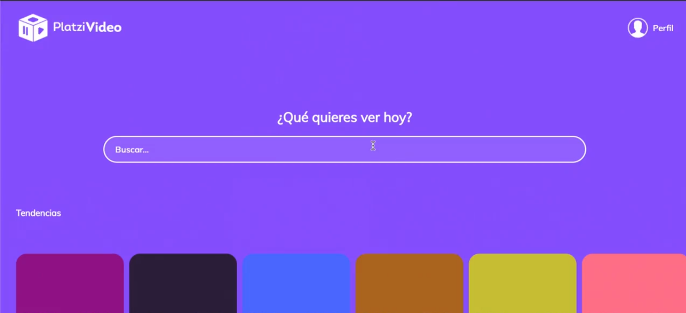

# React-Js

## Tabla de contenido 

[¿Qué es React JS?](#¿Qué-es-React-JS?)

[DOM, Virtual DOM y React DOM](#DOM-Virtual-DOM-y-React-DOM)

## ¿Qué es React JS?

**React** es una librería desarrollada por Facebook que nos ayuda a construir interfaces de usuario interactivas para todo tipo de aplicaciones: web, móviles o de escritorio.

Cada pequeña parte de nuestra página web la conoceremos como **“Componente”**. Cada componente se encargará de una función en específico. Además, podremos reutilizar nuestros componentes siempre que lo necesitemos.

Al unir todos nuestros componentes tendremos una página web que nos permite cambiar, actualizar o eliminar elementos de forma muy sencilla.

Esta basado en componentes por lo cual se deben separar cada uno de los elementos de la pagina web en pequeños pedazos.

React nace en el año 2013 dentro de Facebook donde se queria mejorar la parte principal que hoy en dia se utiliza en esta red social la cual es el **timeline**, ademas tambien esta integrada en instagram. Cuando los desarrolladores se dieron cuenta que esto era un buen producto lo liberaron a la comunidad.

Empresas como Airbnb, netflix, uber, whatsappweb, platzi hacen uso de estas librerias.

El proyecto de este curso se llamara **PlatziVideo**, el cual se viene desarrollando en la escuela de desarrollo web, ademas tendra login, sesiones, registro y un buscador de videos

## DOM, Virtual DOM y React DOM

El **DOM** es el código HTML que se transforma en páginas web.

Cada vez que cambiamos alguna parte del DOM, también estamos actualizando el HTML con el que interactúan nuestros usuarios. El problema es que todas las operaciones, comparaciones y actualizaciones en el DOM son muy costosas.

El **Virtual DOM** es una herramienta que usan tecnologías como React y Vue para mejorar el rendimiento **(performance)** y velocidad de nuestras aplicaciones.

Es una copia exacta del DOM, pero mucho más ligera, ya que los cambios no actualizan el verdadero HTML de nuestras páginas web. Gracias al Virtual DOM podemos hacer operaciones y comparaciones de forma sumamente rápida.

Recuerda que los cambios en el Virtual DOM no afectan el HTML que ven los usuarios, así que debemos estar sincronizando constantemente las copias con el DOM. Pero no te preocupes, **React DOM**lo hace por nosotros.

El Virtual DOM ayuda a actualizar informacion que puede cambiar en la pagina sin la necesidad de tener que cargar cosa por cosa, por ejemplo el **feed** de un usuario en Facebook o twitter; Los datos de sesion de usuario, configuracion, etc. ya estan en el DOM y por ejemplo cuando una persona publica una foto o un estado es lo que se carga automaticamente, pero no afecta el resto de datos y permite que la informacion suba de una manera mas rapida y optima sin necesidad de volver a cargar todos los datos de usuario.